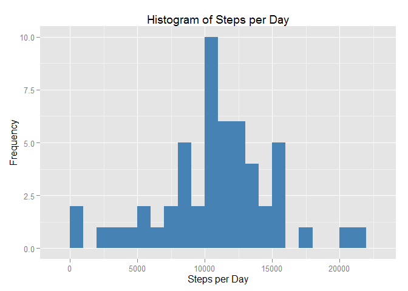
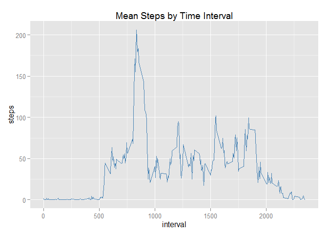
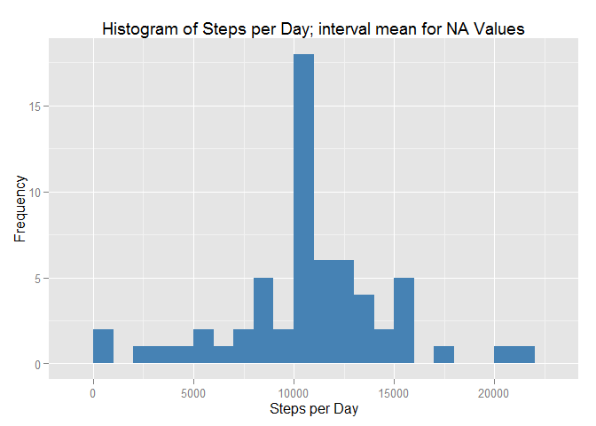
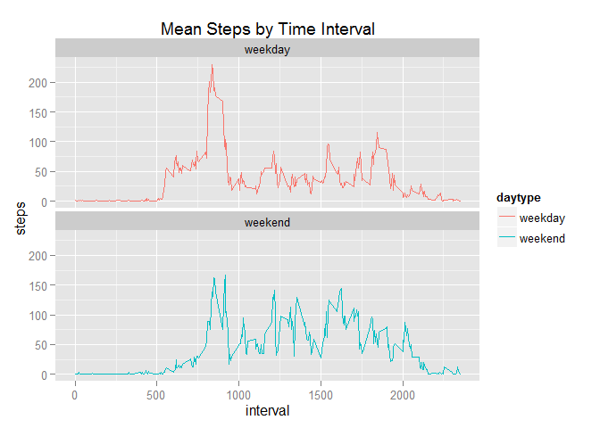

# Reproducible Research Course Project 1
Craig Westhoven  
March 6, 2016  
Load the required packages.

```r
suppressPackageStartupMessages(library(dplyr))
suppressPackageStartupMessages(library(ggplot2))
suppressPackageStartupMessages(library(lubridate))
```

###Loading and preprocessing the data

Show any code that is needed to

1. Load the data (i.e. read.csv())  
2. Process/transform the data (if necessary) into a format suitable for your analysis

Load the data from the working Directory, if you do not have the data in your working directory you may download it from [here](http://d396qusza40orc.cloudfront.net/repdata%2Fdata%2Factivity.zip).


```r
stepData <- read.csv("activity.csv")
```
Format the date variable as a date using the lubridate package

```r
stepData$date <- ymd(stepData$date)
```

###What is mean total number of steps taken per day?

For this part of the assignment, you can ignore the missing values in the dataset.

1. Calculate the total number of steps taken per day

```r
stepsByDay <- aggregate(steps ~ date, data = stepData, sum, na.rm = T)
head(stepsByDay)
```

```
##         date steps
## 1 2012-10-02   126
## 2 2012-10-03 11352
## 3 2012-10-04 12116
## 4 2012-10-05 13294
## 5 2012-10-06 15420
## 6 2012-10-07 11015
```
2. If you do not understand the difference between a histogram and a barplot, research the difference between them. Make a histogram of the total number of steps taken each day

```r
ggplot(stepsByDay, aes(stepsByDay$steps)) + geom_histogram(fill = "steelblue", binwidth = 1000) +
      labs(title = "Histogram of Steps per Day", x = "Steps per Day",y = "Frequency")
```

<!-- -->

3. Calculate and report the mean and median of the total number of steps taken per day

```r
meanSteps <- mean(stepsByDay$steps, na.rm = T)
meanSteps
```

```
## [1] 10766.19
```

```r
medianSteps <- median(stepsByDay$steps, na.rm = T)
medianSteps
```

```
## [1] 10765
```

###What is the average daily activity pattern?

1. Make a time series plot (i.e. type = "l") of the 5-minute interval (x-axis) and the average number of steps taken, averaged across all days (y-axis)

```r
intervalSteps <- aggregate(steps ~ interval, data = stepData, mean, na.rm = T)
ggplot(intervalSteps, aes(interval, steps)) + geom_line(color = "steelblue") + 
      labs(title = "Mean Steps by Time Interval")
```

<!-- -->

2. Which 5-minute interval, on average across all the days in the dataset, contains the maximum number of steps?

```r
intervalSteps[which.max(intervalSteps$steps),]
```

```
##     interval    steps
## 104      835 206.1698
```
The interval 835 on average has the maximum steps.

###Imputing missing values

Note that there are a number of days/intervals where there are missing values (coded as NA). The presence of missing days may introduce bias into some calculations or summaries of the data.

1. Calculate and report the total number of missing values in the dataset (i.e. the total number of rows with NAs)

```r
sum(is.na(stepData))
```

```
## [1] 2304
```

2. Devise a strategy for filling in all of the missing values in the dataset. The strategy does not need to be sophisticated. For example, you could use the mean/median for that day, or the mean for that 5-minute interval, etc.

Lets take the average steps at an interval to fill na step values.

3. Create a new dataset that is equal to the original dataset but with the missing data filled in.

```r
stepDataFull <- stepData
for (ii in 1:nrow(stepDataFull)) {
    if (is.na(stepDataFull$steps[ii])) {
        stepDataFull$steps[ii] <- intervalSteps[
              which(stepDataFull$interval[ii] == intervalSteps$interval), ]$steps
    }
}
head(stepDataFull)
```

```
##       steps       date interval
## 1 1.7169811 2012-10-01        0
## 2 0.3396226 2012-10-01        5
## 3 0.1320755 2012-10-01       10
## 4 0.1509434 2012-10-01       15
## 5 0.0754717 2012-10-01       20
## 6 2.0943396 2012-10-01       25
```

```r
sum(is.na(stepDataFull))
```

```
## [1] 0
```
4. Make a histogram of the total number of steps taken each day and Calculate and report the mean and median total number of steps taken per day. Do these values differ from the estimates from the first part of the assignment? What is the impact of imputing missing data on the estimates of the total daily number of steps?

```r
stepsByDayFull <- aggregate(steps ~ date, data = stepDataFull, sum, na.rm = T)
ggplot(stepsByDayFull, aes(stepsByDayFull$steps)) + geom_histogram(fill = "steelblue", binwidth = 1000) +
      labs(title = "Histogram of Steps per Day; interval mean for NA Values",
           x = "Steps per Day",y = "Frequency")
```

<!-- -->

```r
meanSteps <- mean(stepsByDayFull$steps, na.rm = T)
meanSteps
```

```
## [1] 10766.19
```

```r
medianSteps <- median(stepsByDayFull$steps, na.rm = T)
medianSteps
```

```
## [1] 10766.19
```


###Are there differences in activity patterns between weekdays and weekends?

For this part the weekdays() function may be of some help here. Use the dataset with the filled-in missing values for this part.

1. Create a new factor variable in the dataset with two levels - "weekday" and "weekend" indicating whether a given date is a weekday or weekend day.


```r
stepDataFull <- mutate(stepDataFull, daytype = ifelse(weekdays(stepDataFull$date) == "Saturday"
                                                    | weekdays(stepDataFull$date) == "Sunday", "weekend", "weekday"))
stepDataFull$daytype <- as.factor(stepDataFull$daytype)
head(stepDataFull)
```

```
##       steps       date interval daytype
## 1 1.7169811 2012-10-01        0 weekday
## 2 0.3396226 2012-10-01        5 weekday
## 3 0.1320755 2012-10-01       10 weekday
## 4 0.1509434 2012-10-01       15 weekday
## 5 0.0754717 2012-10-01       20 weekday
## 6 2.0943396 2012-10-01       25 weekday
```

2. Make a panel plot containing a time series plot (i.e. type = "l") of the 5-minute interval (x-axis) and the average number of steps taken, averaged across all weekday days or weekend days (y-axis). See the README file in the GitHub repository to see an example of what this plot should look like using simulated data.


```r
intervalStepsFull <- aggregate(steps ~ interval + daytype, data = stepDataFull, mean, na.rm = T)
ggplot(intervalStepsFull, aes(x = interval, y= steps, color = daytype)) + geom_line() + 
      labs(title = "Mean Steps by Time Interval") +
      facet_wrap( ~ daytype, nrow = 2, ncol = 1)
```

<!-- -->
